# Pejastip Handal

Web order & tracking untuk jastip (jasa titip) buku impor: katalog per batch PO, form order dengan DP, upload bukti transfer, pelacakan order dengan kode, dan dashboard admin untuk verifikasi pembayaran, pengiriman, dan stok.

**Live:** [pejastip-handal.vercel.app](https://pejastip-handal.vercel.app)

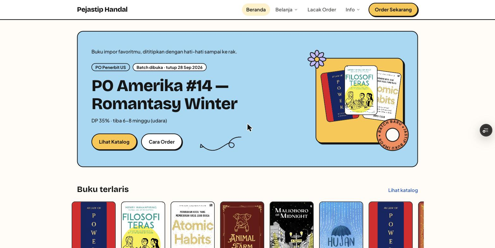

## Highlight MVP

### Untuk customer
- **Katalog per batch PO** dengan sisa stok langsung terlihat. Buku yang habis tidak bisa dipesan.
- **Form order satu halaman** dengan slip order yang ikut berubah saat buku dipilih. Pilih bayar **DP** atau **lunas**.
- **Lacak order pakai kode** tanpa perlu akun: status bayar, status tiap buku, resi, dan riwayat pembayaran (termasuk alasan kalau bukti ditolak).
- **Upload bukti transfer** saat order dan saat pelunasan. Nominal pelunasan terisi otomatis dari sisa tagihan.
- **Form kirim**: gabung beberapa order atau kirim sebagian, pilih kurir, isi alamat.
- **Request buku** di luar katalog.

### Untuk admin
- **Verifikasi pembayaran** dengan pratinjau bukti, koreksi nominal sesuai mutasi, dan tolak yang wajib diberi alasan.
- **Status bayar dihitung, bukan diketik**: Belum Bayar → DP Diterima → Lunas berubah sendiri dari pembayaran yang sudah diverifikasi. Ada juga pencatatan pembayaran manual dan refund kelebihan bayar.
- **Event/batch** dengan jadwal buka-tutup yang ditegakkan server. Saat status batch berubah (mis. buku tiba), status semua buku di dalamnya ikut berubah.
- **Katalog**: import CSV, unggah sampul, edit harga/stok langsung di tabel, cari dan urutkan.
- **Order manual** untuk pesanan dari WhatsApp, edit isi order, dan status kirim per buku.
- **Pengiriman** (resi, ongkir, layanan) dan **customer** (piutang, riwayat order, blacklist yang wajib diberi alasan).
- **Pengaturan toko** (rekening, WA, kurir, persentase DP, S&K) tanpa perlu mengubah kode.

### Keamanan & integritas data
- **Aturan bisnis ada di database**, bukan di tombol UI: semua perubahan lewat RPC Postgres `security definer` + RLS. Contohnya stok, batas waktu batch, dan status bayar.
- **Stok dipotong saat order dibuat**, bukan saat dibayar, supaya dua pembeli tidak bisa merebut buku terakhir.
- **Admin berbasis allowlist** (`is_admin()` di semua policy, storage, dan RPC admin), bukan "siapa pun yang login".
- **Rate limit per IP** diambil dari header di server, bukan dari parameter yang bisa dipalsukan client.
- **Upload bukti dibatasi** ke folder order itu sendiri, dengan tipe file dan ukuran maksimal 5 MB ditegakkan bucket.
- **Form kirim butuh kode dan nomor WA yang cocok**, jadi kode yang bocor saja tidak cukup untuk mengubah alamat kiriman.
- **Diuji dengan 50 skenario penyalahgunaan** sebagai klien anonim langsung ke Supabase: 49 bertahan, 1 temuan (teks tanpa batas panjang) sudah ditutup.

## Stack

- **Next.js 16** (App Router, static export) + React 19 + TypeScript
- **Supabase**: Postgres, Auth (admin), Storage (bukti transfer, sampul buku)
- Aturan bisnis ditegakkan di database lewat RPC `security definer` + RLS, bukan di UI: stok, status bayar, batas waktu batch, rate limit, allowlist admin
- Hosting: Vercel (production dari `main`, preview per branch)

## Pengujian end-to-end: order dengan DP lalu pelunasan

Diuji 23 Sep 2026 di URL preview, dengan browser sungguhan. Customer memakai halaman publik, admin memakai dashboard. Semua data ditandai sebagai data uji: customer "UJI E2E DP Lunas", order `ORD-2609-0126`, dan bukti transfer bergambar "DATA UJI".

| # | Langkah | Hasil yang diharapkan | Hasil |
|---|---|---|---|
| 1 | Customer pilih 2 buku (Atomic Habits Rp185.999 + Malioboro at Midnight Rp115.000) | Total Rp300.999, DP 35% = Rp105.350 | ✅ |
| 2 | Coba tambah buku yang stoknya habis (Filosofi Teras) | Tombol Tambah nonaktif | ✅ |
| 3 | Kirim order dengan opsi DP | Kode pelacakan + rekening muncul | ✅ `KNPQY99A` |
| 4 | Upload bukti DP | Status tetap Belum Bayar, pembayaran "Menunggu verifikasi" | ✅ |
| 5 | Admin verifikasi DP | Status DP Diterima, sisa Rp195.649 | ✅ |
| 6 | Customer upload bukti pelunasan | Nominal otomatis terisi sisa tagihan | ✅ Rp195.649 |
| 7 | Admin verifikasi pelunasan | Status Lunas, sisa Rp0, order otomatis Dikonfirmasi | ✅ |
| 8 | Cek stok di katalog admin | Malioboro berkurang 1 saat order dibuat (4 → 3 dari 5) | ✅ |

Catatan: pelunasan dibayar saat buku masih berstatus "Belum Berangkat". Status batch sengaja tidak dimajukan dalam uji ini karena perubahan status batch berlaku ke semua order di batch yang sama.

### Customer: membuat order dengan DP

| | |
|---|---|
|  **1. Beranda**, batch yang sedang buka | 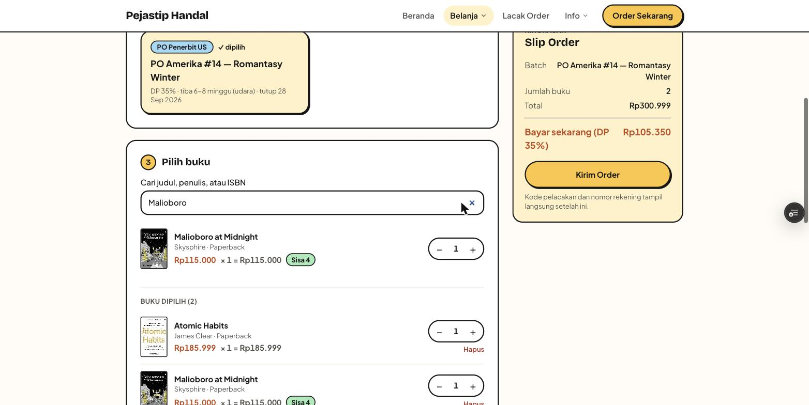 **2. Pilih buku**, slip order ikut berubah |
| 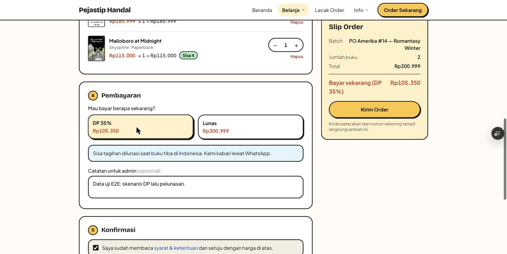 **3. Pilih DP 35%** dan setujui S&K | 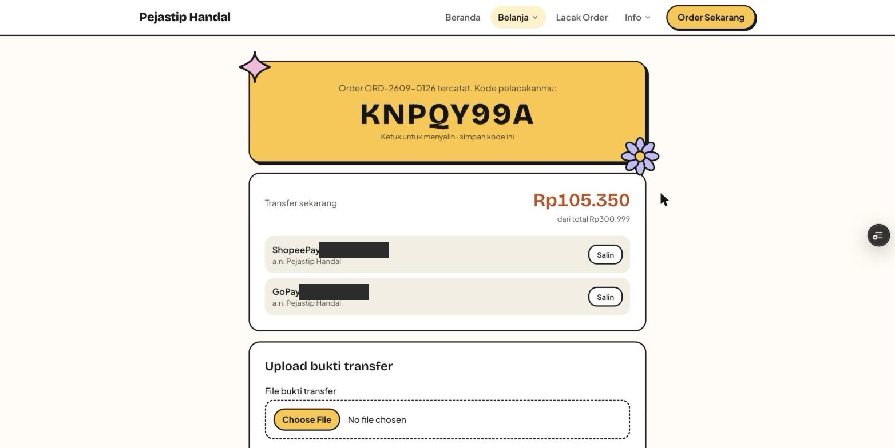 **4. Order tercatat**, kode pelacakan muncul |
| 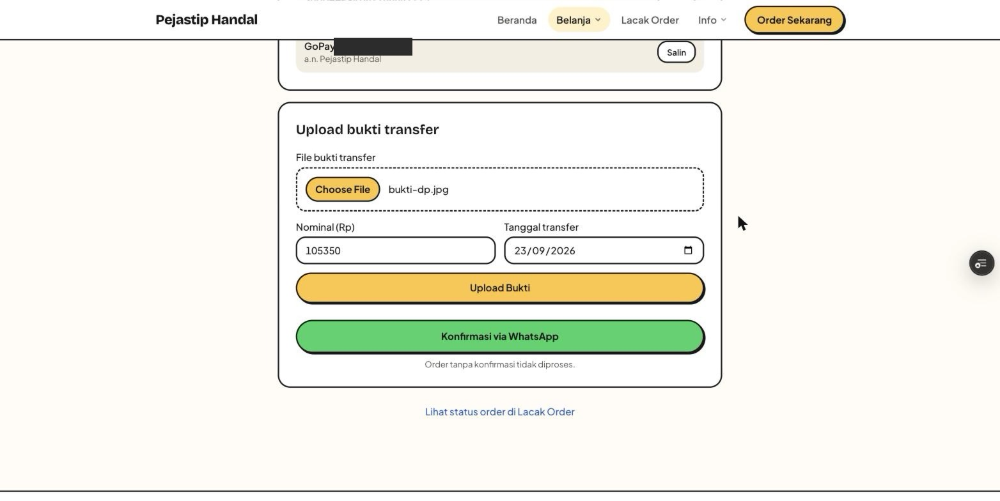 **5. Upload bukti DP**, nominal & tanggal terisi otomatis | 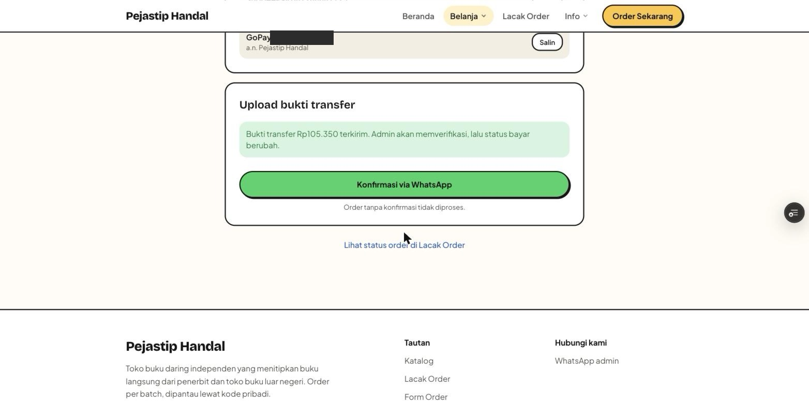 **6. Bukti terkirim** |
| 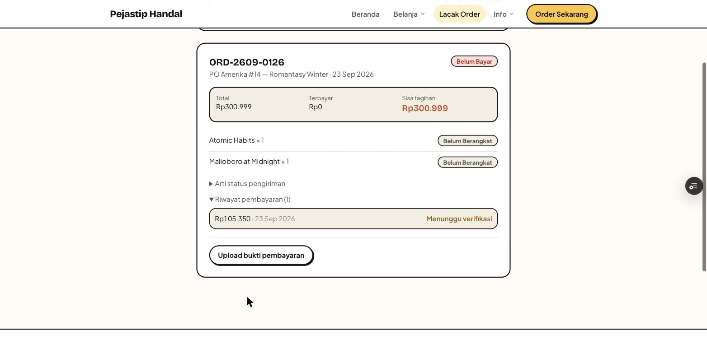 **7. Lacak order**: belum dihitung sebelum diverifikasi | |

### Admin: verifikasi DP

| | |
|---|---|
| 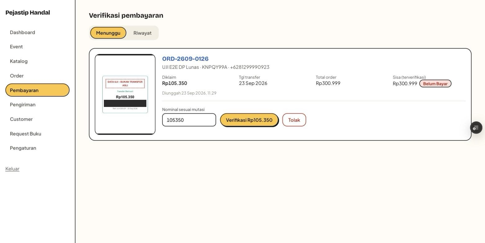 **8. Antrean verifikasi** dengan pratinjau bukti | 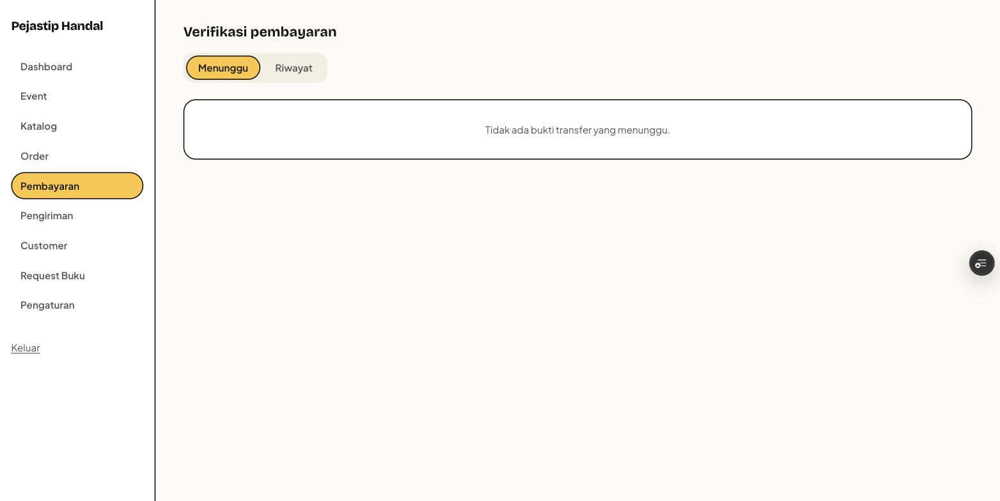 **9. Setelah diverifikasi**, antrean kosong |
| 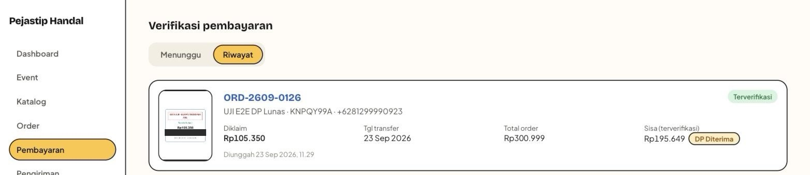 **10. Riwayat**: DP Diterima, sisa Rp195.649 | 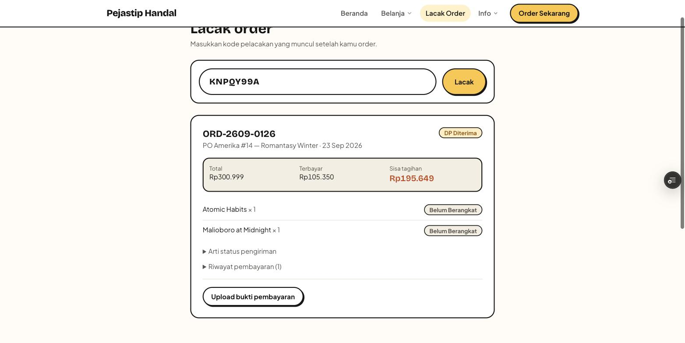 **11. Sisi customer** ikut berubah |

### Customer: pelunasan

| | |
|---|---|
| 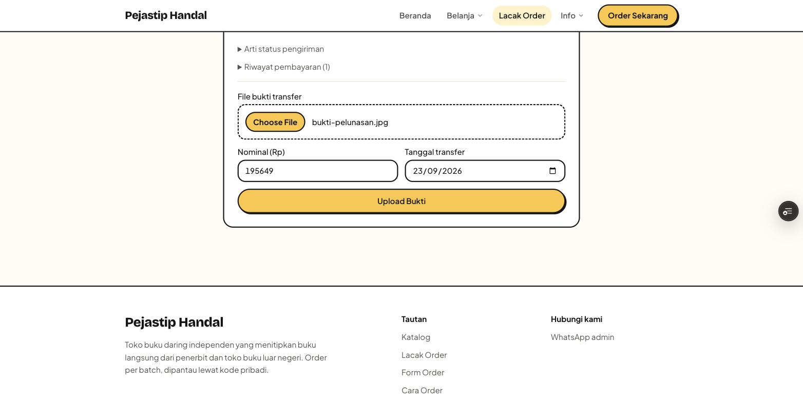 **12. Upload bukti pelunasan** dari halaman lacak | 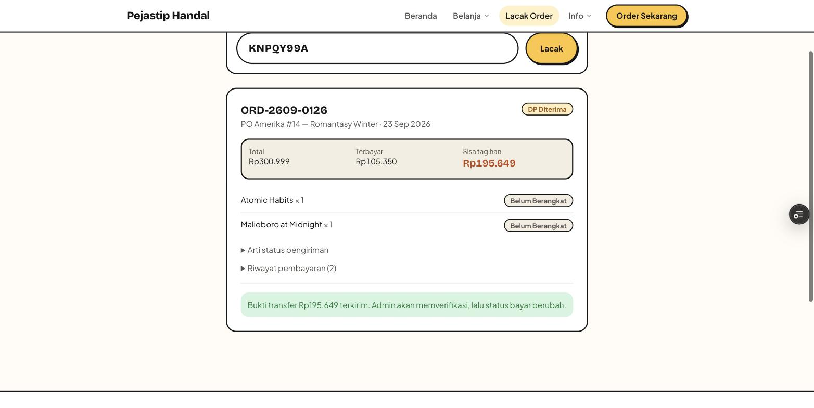 **13. Bukti terkirim** |

### Admin: verifikasi pelunasan

| | |
|---|---|
| 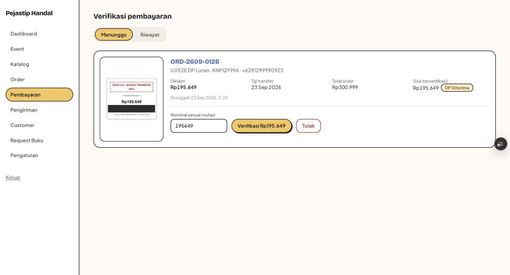 **14. Antrean pelunasan** | 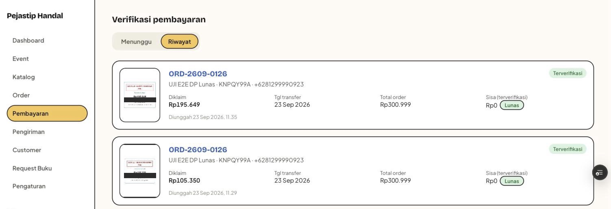 **15. Dua pembayaran terverifikasi**, Lunas |
| 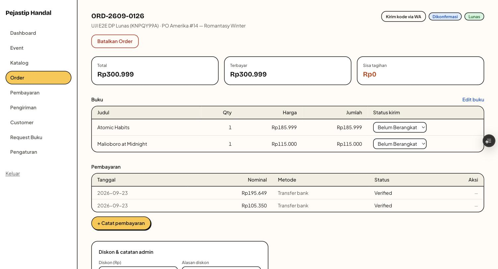 **16. Detail order**: terbayar Rp300.999, status Dikonfirmasi | 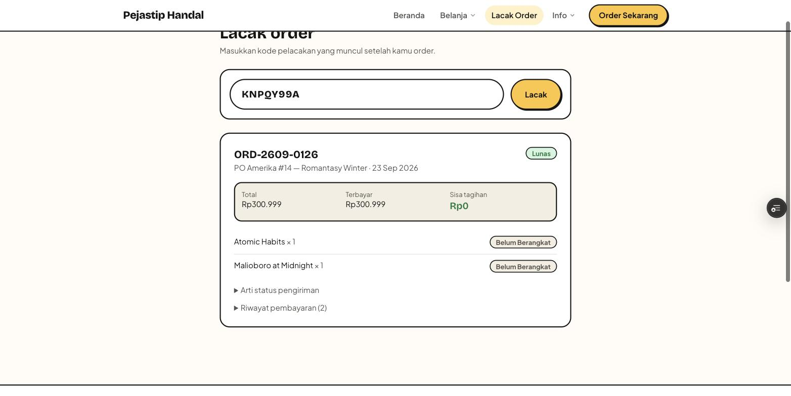 **17. Sisi customer**: Lunas, sisa Rp0 |
| 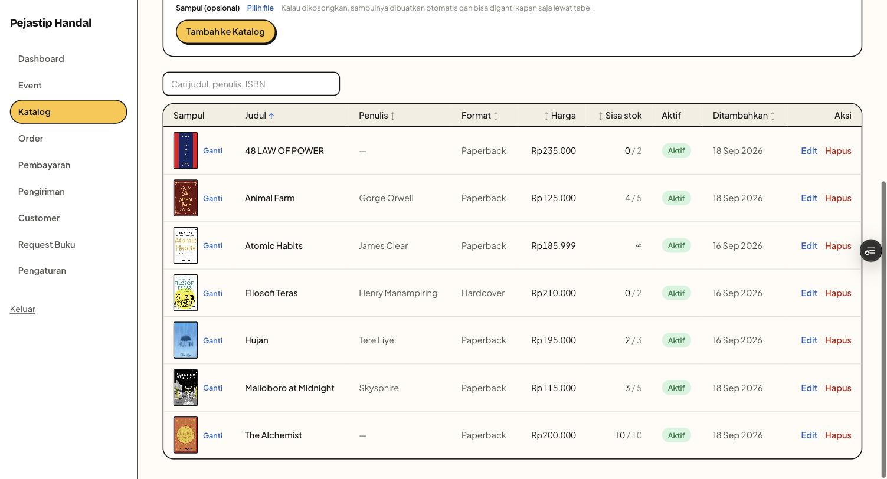 **18. Stok katalog**: Malioboro sisa 3/5 | |

## Menjalankan lokal

```bash
pnpm install
cp .env.example .env.local   # isi URL & anon key Supabase
pnpm dev
```
