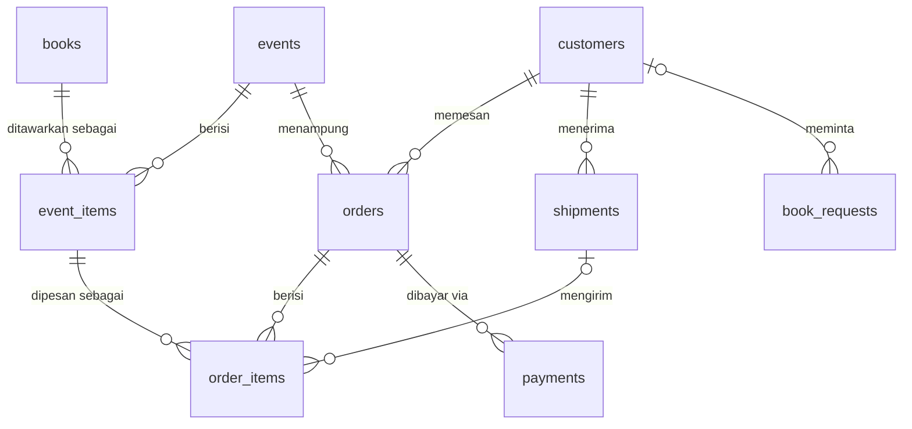

# Desain Skema Database

Target: PostgreSQL (Supabase). Skema ini mengikuti alur operasional ala Blossom Books yang sudah kita sepakati: penjualan berbasis **event/batch**, order lewat **form** (bukan cart), pembayaran **manual dengan verifikasi bukti transfer**, tracking dengan **kode customer**, dan pengiriman **parsial** (buku dalam satu order bisa tiba dan dikirim bergelombang).

## Prinsip desain

1. **Event adalah unit operasional.** Semua kerja massal (buka PO, tutup PO, "sudah sampai Indo") terjadi di level event, lalu diteruskan ke item-item order di bawahnya lewat bulk update. Ini yang menggantikan pekerjaan edit gsheet baris per baris.
2. **Status pembayaran tidak disimpan, tapi dihitung** dari jumlah pembayaran terverifikasi vs total order (view `v_order_payment`). Menyimpan status sebagai kolom akan menciptakan dua sumber kebenaran yang bisa saling bertentangan.
3. **Status pengiriman melekat pada item, bukan order**, karena di jastip PO satu order sering tiba bergelombang. Blossom menampilkan status per buku di tracker-nya; kita ikuti.
4. **Kode customer adalah bearer token.** Siapa pun yang tahu kode bisa melihat data order (ala Blossom). Konsekuensinya kode harus acak dan tidak bisa ditebak (bukan urutan), dan lookup harus di-rate-limit di server.
5. **Harga disimpan sebagai snapshot** di `order_items.unit_price_idr`. Harga di katalog boleh berubah; harga yang sudah disepakati customer tidak.

## ERD



## DDL

```sql
-- =====================
-- ENUMS
-- =====================
create type event_type as enum (
  'publisher_po_us',   -- PO penerbit US (udara/laut)
  'publisher_po_uk',   -- PO / direct UK
  'ready_stock',
  'secondhand',        -- ala Vinted di Blossom
  'special_edition',
  'bbw_jastip',        -- Big Bad Wolf / bazar
  'other'
);

create type event_status as enum (
  'draft',            -- disiapkan admin, belum tampil
  'open',             -- menerima order
  'closed',           -- PO ditutup, menunggu dibelanjakan
  'ordered',          -- sudah dibelanjakan ke penerbit/supplier
  'shipped_to_indo',
  'arrived',          -- tiba di tangan admin
  'completed',
  'cancelled'
);

create type book_format as enum ('paperback', 'hardcover', 'boxset', 'other');

create type order_status as enum (
  'pending',    -- masuk dari form, belum dikonfirmasi admin
  'confirmed',  -- admin sudah verifikasi (minimal DP terverifikasi)
  'completed',  -- semua item terkirim & lunas
  'cancelled'
);

create type payment_method as enum ('bank_transfer', 'shopeepay', 'qris', 'other');
-- 'qris' dicadangkan untuk fase gateway; enum tidak perlu diubah nanti.

create type payment_review_status as enum ('pending', 'verified', 'rejected');

create type item_shipping_status as enum (
  'not_shipped',      -- belum dibelanjakan / belum jalan
  'shipped_to_indo',
  'arrived_in_indo',  -- sudah di tangan admin
  'waiting_courier',  -- shipping form sudah diisi, menunggu diserahkan kurir
  'shipped',          -- resi terbit
  'delivered'
);

create type request_status as enum ('new', 'sourcing', 'quoted', 'fulfilled', 'rejected');

-- =====================
-- TABEL
-- =====================
create table customers (
  id               uuid primary key default gen_random_uuid(),
  code             text not null unique,      -- token tracker, acak (mis. base32 8 char), BUKAN sekuensial
  full_name        text not null,
  whatsapp         text not null unique,      -- format E.164 (+62...), dinormalisasi di server
  instagram        text,
  is_blacklisted   boolean not null default false,
  blacklist_reason text,
  notes            text,                       -- catatan internal admin
  created_at       timestamptz not null default now()
);

create table events (
  id               uuid primary key default gen_random_uuid(),
  name             text not null,              -- "US Publisher PO Batch 12"
  type             event_type not null,
  status           event_status not null default 'draft',
  dp_percent       numeric(5,2) not null default 35,  -- 35 PO, 50 special edition, 100 ready stock/BBW
  payment_due_hours integer,                   -- null = pelunasan saat notifikasi tiba; 48 = ready stock; 12 = BBW
  eta_note         text,                       -- "1-2 bulan (udara)" — teks bebas, tampil di Ongoing Orders
  description      text,
  opens_at         timestamptz,
  closes_at        timestamptz,
  created_at       timestamptz not null default now()
);

create table books (
  id         uuid primary key default gen_random_uuid(),
  isbn       text,                             -- nullable: buku secondhand kadang tanpa ISBN
  title      text not null,
  author     text,
  format     book_format not null default 'paperback',
  cover_url  text,
  notes      text,
  created_at timestamptz not null default now()
);
-- ISBN unik hanya jika terisi:
create unique index books_isbn_unique on books (isbn) where isbn is not null;

-- Buku yang ditawarkan di sebuah event, dengan harga & stok khusus event itu.
-- Satu ISBN bisa muncul di banyak event dengan harga berbeda (kurs & ongkir impor berubah).
create table event_items (
  id         uuid primary key default gen_random_uuid(),
  event_id   uuid not null references events(id) on delete cascade,
  book_id    uuid not null references books(id),
  price_idr  integer not null check (price_idr >= 0),
  stock      integer,                          -- null = tanpa batas (PO), angka = ready stock
  is_active  boolean not null default true,
  unique (event_id, book_id)
);

create table orders (
  id             uuid primary key default gen_random_uuid(),
  order_code     text not null unique,         -- human-readable: ORD-2601-0042
  customer_id    uuid not null references customers(id),
  event_id       uuid not null references events(id),
  status         order_status not null default 'pending',
  subtotal_idr   integer not null check (subtotal_idr >= 0),
  discount_idr   integer not null default 0 check (discount_idr >= 0),
  discount_note  text,                         -- "loyalty claim", "member lama", dll.
  total_idr      integer generated always as (subtotal_idr - discount_idr) stored,
  customer_notes text,                         -- dari form
  admin_notes    text,                         -- tampil di tracker ("Notes from admin" ala Blossom)
  created_at     timestamptz not null default now()
);

create table shipments (
  id              uuid primary key default gen_random_uuid(),
  customer_id     uuid not null references customers(id),
  courier         text not null,               -- teks bebas dari daftar di settings (JNE, J&T, ...)
  service         text,                        -- REG/YES/dll.
  tracking_number text,                        -- resi; null = belum diserahkan kurir
  shipping_cost_idr integer,
  address_street  text not null,
  address_detail  text,
  city            text not null,
  province        text not null,
  postal_code     text not null,
  shipped_at      timestamptz,
  delivered_at    timestamptz,
  created_at      timestamptz not null default now()
);
-- shipments menempel ke CUSTOMER, bukan ke order, supaya gabung-kirim
-- (item dari beberapa order sekaligus) berjalan natural.

create table order_items (
  id              uuid primary key default gen_random_uuid(),
  order_id        uuid not null references orders(id) on delete cascade,
  event_item_id   uuid not null references event_items(id),
  qty             integer not null default 1 check (qty > 0),
  unit_price_idr  integer not null,            -- snapshot harga saat order
  shipping_status item_shipping_status not null default 'not_shipped',
  shipment_id     uuid references shipments(id),  -- null = belum masuk pengiriman
  notes           text
);

create table payments (
  id          uuid primary key default gen_random_uuid(),
  order_id    uuid not null references orders(id) on delete cascade,
  amount_idr  integer not null check (amount_idr > 0),
  method      payment_method not null,
  proof_url   text,                            -- Supabase Storage (bucket privat)
  status      payment_review_status not null default 'pending',
  paid_at     date,                            -- tanggal transfer menurut customer
  verified_at timestamptz,
  notes       text,
  created_at  timestamptz not null default now()
);

create table book_requests (
  id            uuid primary key default gen_random_uuid(),
  customer_id   uuid references customers(id), -- null = pengunjung yang belum pernah order
  customer_name text not null,
  whatsapp      text not null,
  title         text not null,
  isbn          text,
  notes         text,
  status        request_status not null default 'new',
  created_at    timestamptz not null default now()
);

-- Konfigurasi operasional: rekening, nomor WA admin, daftar kurir,
-- teks T&C, default dp_percent per tipe event, dsb.
create table settings (
  key        text primary key,
  value      jsonb not null,
  updated_at timestamptz not null default now()
);

-- =====================
-- INDEX
-- =====================
create index orders_customer_idx  on orders (customer_id);
create index orders_event_idx     on orders (event_id, status);
create index order_items_order_idx on order_items (order_id);
create index order_items_shipment_idx on order_items (shipment_id) where shipment_id is not null;
create index payments_order_idx   on payments (order_id, status);
create index event_items_event_idx on event_items (event_id) where is_active;

-- =====================
-- VIEWS (status turunan)
-- =====================
-- Status pembayaran per order: Not Paid / Partially Paid / Fully Paid / Overpaid (ala Blossom)
create view v_order_payment as
select
  o.id as order_id,
  o.total_idr,
  coalesce(sum(p.amount_idr) filter (where p.status = 'verified'), 0) as paid_idr,
  greatest(o.total_idr - coalesce(sum(p.amount_idr) filter (where p.status = 'verified'), 0), 0) as balance_idr,
  case
    when coalesce(sum(p.amount_idr) filter (where p.status = 'verified'), 0) = 0 then 'not_paid'
    when coalesce(sum(p.amount_idr) filter (where p.status = 'verified'), 0) <  o.total_idr then 'partially_paid'
    when coalesce(sum(p.amount_idr) filter (where p.status = 'verified'), 0) =  o.total_idr then 'fully_paid'
    else 'overpaid'
  end as payment_state
from orders o
left join payments p on p.order_id = o.id
group by o.id, o.total_idr;

-- Piutang per customer (untuk dashboard admin & penagihan)
create view v_customer_balance as
select
  c.id as customer_id, c.code, c.full_name,
  sum(vp.balance_idr) as total_balance_idr,
  count(*) filter (where vp.payment_state in ('not_paid','partially_paid')) as unpaid_orders
from customers c
join orders o  on o.customer_id = c.id and o.status not in ('cancelled')
join v_order_payment vp on vp.order_id = o.id
group by c.id, c.code, c.full_name;
```

## Model akses (Supabase)

Frontend statis (Cloudflare Pages), tanpa server Node — lihat README §Tech stack untuk alasan. Trust boundary karena itu bukan "server route", tapi **RPC Postgres (`security definer`)**, konsisten dengan lesson dari sirviu yang sudah dicatat di `CLAUDE.md`: trust boundary sebenarnya ada di RPC/RLS, bukan di komponen.

- **RLS aktif dan deny-by-default di semua tabel dasar.** Tidak ada SELECT/INSERT/UPDATE langsung dari browser dengan anon key untuk data customer/order/payment. Satu-satunya jalan masuk/keluar adalah function `security definer` (mis. `create_order`, `submit_payment_proof`, `get_tracker`) yang memvalidasi qty, stok, blacklist, dan idempotency di dalam transaksi — bukan di klien. Katalog (`events`, `event_items`, `books`) boleh RLS `select` publik langsung karena read-only dan tidak sensitif.
- **Logic yang tidak bisa jalan di Postgres** (panggilan HTTP keluar, mis. verifikasi Cloudflare Turnstile) jalan di **Supabase Edge Function**, yang kemudian memanggil RPC yang sama — bukan jalur data terpisah.
- **Admin** login lewat Supabase Auth (satu akun cukup untuk sekarang). CRUD biasa (lihat event, edit katalog) boleh lewat RLS langsung untuk authenticated user berklaim admin; aksi sensitif (bulk update status, override, hard delete, verifikasi pembayaran) tetap lewat RPC `security definer` yang menurunkan `admin_id` dari `auth.uid()` — bukan dari parameter klien (lesson yang sama arah sebaliknya: klien tidak dipercaya membuktikan dirinya admin selain lewat JWT Supabase Auth).
- **Bukti transfer** di bucket Storage privat; URL yang diberikan ke admin adalah signed URL berumur pendek.
- **Lookup kode** (tracker & shipping form) di-rate-limit per IP lewat tabel `rate_limits` yang dicek di dalam RPC yang sama sebelum query jalan, karena kode adalah satu-satunya "autentikasi" customer.

## Keputusan yang sengaja ditunda (fase 2)

- **Loyalty**: kolom `orders.discount_idr` + `discount_note` sudah cukup sebagai tempat mendaratnya diskon. Logika eligibility (5 buku PO lunas → Rp15.000) dihitung via query saat fase 2, tanpa perubahan skema.
- **Gateway (Midtrans/Xendit)**: pembayaran gateway masuk sebagai baris `payments` baru dengan `method = 'qris'` dan `status = 'verified'` otomatis dari webhook. Tidak ada perombakan.
- **Wishlist board & notifikasi WA otomatis**: belum ada tabelnya, sengaja; tambah nanti bila terbukti perlu.

## Migrasi data gsheet

Satu skrip sekali jalan: ekspor gsheet ke CSV → normalisasi nomor WA → upsert `customers` (generate `code` untuk semua customer lama) → buat `events` historis seperlunya → muat `orders` + `order_items` + `payments` lama yang masih berjalan. Order yang sudah selesai total boleh diarsip sebagai satu event "Historis" agar riwayat loyalty tetap terhitung nantinya.
